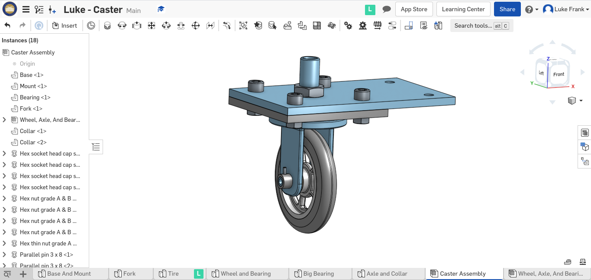
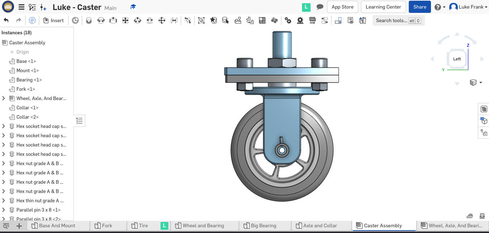
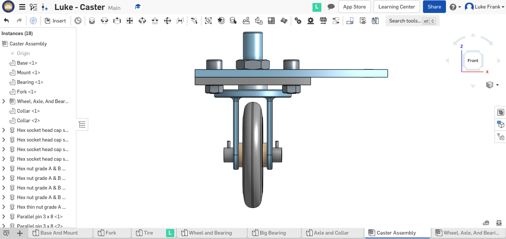

# OnShape Caster
## The series of assignments that introduced me to OnShape CAD design. 

The assignments that were part of the assignment were:
* Part 1 - Base
* Part 2 - Mount 
* Part 3 - Fork 
* Part 4 - Tire
* Part 5 - Wheel 
* Part 6-9 - Axle, Collar, and Bearing
* Sub-Assembly - A sub-assembly of the wheel, axle, and bearing
* Final Caster Assembly - The final assembly 

I did my work in an OnShape document. An amazing feature of OnShape is that the concepts of parts, sub-assemblies, and assemblies can all be put into one document. In the document, different tabs contain seperate parts or assemblies. Each tab can have multiple parts in it, for the purpose of building off of exisiting geometry.

Here is my finished product:

